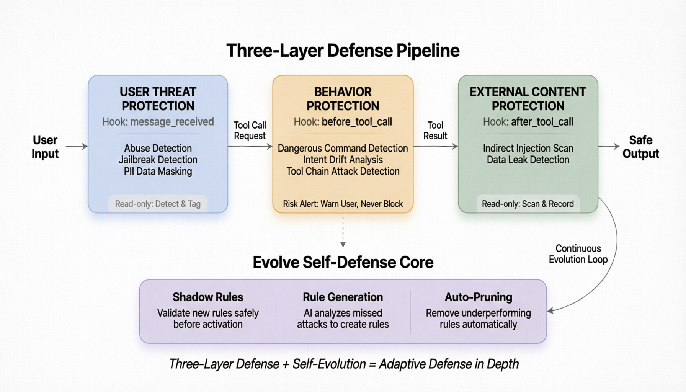
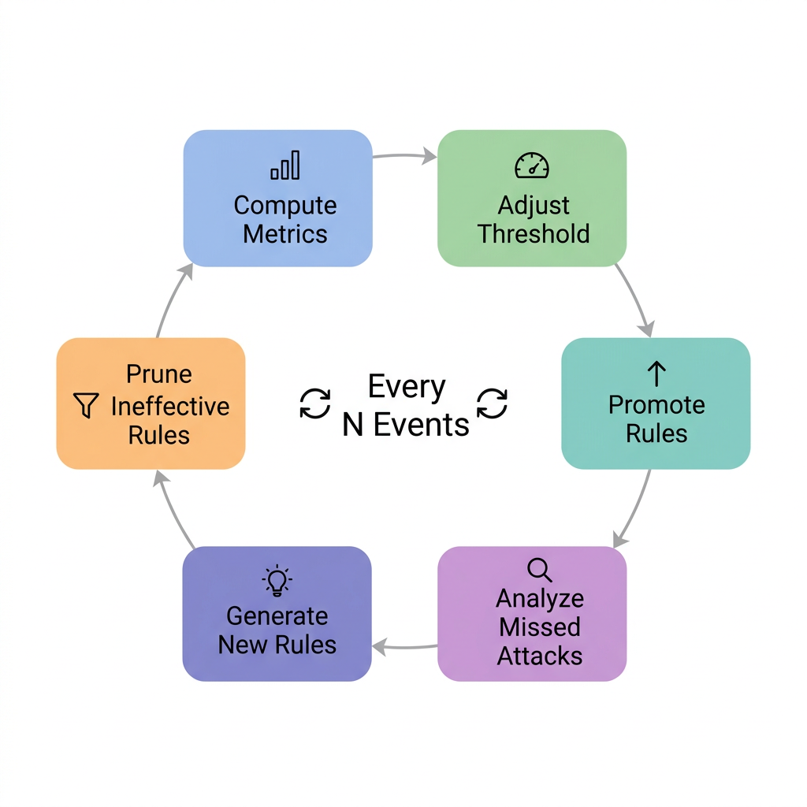

# ClawArmor

> **AI Agent 自进化防御系统** — 通过自适应安全机制防御提示词注入、数据外泄和多阶段攻击，随时间持续学习并提升防御能力。

[](LICENSE)
[](package.json)
[](https://openclaw.dev)
[](https://nodejs.org)

---

## 核心亮点 / 为什么选择 ClawArmor

- **解决误报难题** — 不同的业务场景，需要不同的防御策略。静态规则会产生大量误报/漏报，严重影响用户体验。ClawArmor 学习每个业务场景的正常/异常模式，自动生成针对性规则。
- **零干预持续安全提升** — 自动从失败中学习，识别防御短板并生成新的检测规则，无需人工干预。系统会随时间变得越来越智能。
- **多层防护** — 三个核心检测点位（输入、行为、输出），实现 AI Agent 全生命周期的全面覆盖。
- **工具链攻击检测** — 识别跨越多个工具调用的多阶段攻击（如侦察 → 凭据读取 → 数据外泄）。
- **Shadow → Active 规则生命周期** — 新规则以 Shadow 模式启动（仅监控），验证通过后晋升至 Active 模式，低效规则将被淘汰。
- **实时监控 Dashboard** — 基于 Web 的监控面板，地址为 `http://127.0.0.1:18790`，实时展示威胁态势。

---

## 演示

<div align="center">
<table>
<tr>
<td align="center"><p style="margin:0 0 8px 0; color:#666; font-size:13px;">直接注入检测 — 实时检测直接提示词注入攻击</p><video title="直接注入检测" alt="实时检测直接提示词注入攻击" src="https://github.com/user-attachments/assets/24da407f-17b2-4dff-b267-f620ab3effc3" controls preload="metadata" style="width:100%; max-width:600px; height:338px; object-fit:cover;"></video></td>
</tr>
<tr>
<td align="center"><p style="margin:0 0 8px 0; color:#666; font-size:13px;">间接注入检测 — 检测隐藏在工具返回中的注入攻击</p><video title="间接注入检测" alt="检测隐藏在工具返回中的注入攻击" src="https://github.com/user-attachments/assets/176d0282-828e-4029-8531-2cf2dbf68efa" controls preload="metadata" style="width:100%; max-width:600px; height:338px; object-fit:cover;"></video></td>
</tr>
<tr>
<td align="center"><p style="margin:0 0 8px 0; color:#666; font-size:13px;">攻击链检测 — 跨工具调用的完整攻击链检测</p><video title="攻击链检测" alt="跨工具调用的完整攻击链检测" src="https://github.com/user-attachments/assets/d77c6070-d18f-41a1-96e6-f3922471f83d" controls preload="metadata" style="width:100%; max-width:600px; height:338px; object-fit:cover;"></video></td>
</tr>
<tr>
<td align="center"><p style="margin:0 0 8px 0; color:#666; font-size:13px;">规则进化 — Shadow 规则验证后晋升为 Active</p><video title="规则进化" alt="Shadow 规则验证后晋升为 Active" src="https://github.com/user-attachments/assets/7bf8a039-f152-461d-a472-de3628e5ebe3" controls preload="metadata" style="width:100%; max-width:600px; height:338px; object-fit:cover;"></video></td>
</tr>
<tr>
<td align="center"><p style="margin:0 0 8px 0; color:#666; font-size:13px;">自进化升级 — ClawArmor 自升级与防御进化</p><video title="自进化升级" alt="ClawArmor 自升级与防御进化" src="https://github.com/user-attachments/assets/972ba70c-7647-4bb4-b85d-7fadc577237e" controls preload="metadata" style="width:100%; max-width:600px; height:338px; object-fit:cover;"></video></td>
</tr>
</table>
</div>

---

## 架构概览

ClawArmor 实现了**纵深防御 + 自适应进化**的架构，在 **3 个关键 Hook 点位**进行拦截，并通过进化引擎持续优化防御规则。




系统由上下两层构成。上层**三段式纵深防御管线**依次处理用户输入：
- **用户威胁防护层**（Hook: `message_received`）— 提示词注入和敏感数据的只读检测
- **行为防护层**（Hook: `before_tool_call`）— 危险命令的风险提醒，支持阻断
- **外部内容防护层**（Hook: `after_tool_call`）— 间接注入的只读扫描

下层**Evolve 自防御核心**管理 Shadow、Active、Deprecated 三阶段规则生命周期，配合自适应阈值控制和反馈学习，持续优化上层防御策略。

### 规则生命周期

新规则从 **Shadow 模式**（仅监控）开始，验证通过后（命中 ≥ 3 次且误报率 ≤ 30%）晋升为 **Active**，效果不佳则淘汰（有效性 < 0.2）。

---

## 快速开始

### 前置要求

- **Node.js** >= 18.0.0
- **OpenClaw** >= v2026.4.1（插件系统兼容性）
- **LLM API Key**（可选但推荐，用于自进化功能）

### 安装

```bash
# 克隆仓库
git clone https://github.com/clawarmor/clawarmor-evolve.git
cd clawarmor-evolve/ClawArmor-OpenClaw-Plugin

# 安装依赖
npm install

# 构建并安装插件
npm run install-plugin
```

### 配置

创建配置文件：

```bash
mkdir -p ~/.openclaw/clawarmor
cat > ~/.openclaw/clawarmor/config.json << 'EOF'
{
  "enabled": true,
  "blockOnCritical": true,
  "blockOnHighRisk": false,
  "maskSensitiveData": true,
  "evolveEnabled": true,
  "evolveLlmApiBase": "https://api.openai.com/v1",
  "evolveLlmApiKey": "sk-your-api-key-here",
  "evolveLlmModel": "gpt-4",
  "evolveUpdateInterval": 5,
  "evolveTargetFpRate": 0.05,
  "evolveTargetFnRate": 0.02
}
EOF
chmod 600 ~/.openclaw/clawarmor/config.json
```

### 启动

```bash
# 启动 OpenClaw 网关（ClawArmor 会自动加载）
openclaw gateway start

# 或启动 Dashboard 进行监控
npm run dashboard
# Dashboard 地址 http://127.0.0.1:18790
```

### 验证安装

```bash
# 查看 ClawArmor 日志
tail -f ~/.openclaw/logs/gateway.log | grep "\[ClawArmor\]"

# 查看告警
tail -f ~/.openclaw/logs/gateway.log | grep "\[ClawArmor\]" | grep -E "warn|WARN"

# 监控进化事件
tail -f ~/.openclaw/logs/gateway.log | grep -E "EVOLVE|evolution"
```

---

## 配置参考

配置优先级（从高到低）：**环境变量 > 配置文件 > 默认值**

| 配置项 | 环境变量 | 默认值 | 说明 |
|-------------|---------------------|---------|-------------|
| `enabled` | `CLAWARMOR_ENABLED` | `true` | 启用/禁用 ClawArmor 防护 |
| `blockOnCritical` | `CLAWARMOR_BLOCK_CRITICAL` | `false` | 检测到 CRITICAL 风险时阻断请求 |
| `blockOnHighRisk` | `CLAWARMOR_BLOCK_HIGH` | `false` | 检测到 HIGH 风险时阻断请求 |
| `logAllChecks` | `CLAWARMOR_LOG_ALL` | `false` | 记录所有安全检查日志（用于调试） |
| `maxInputLength` | `CLAWARMOR_MAX_LENGTH` | `10000` | 最大输入长度限制 |
| `maskSensitiveData` | `CLAWARMOR_MASK_DATA` | `true` | 在日志中脱敏敏感数据（API Key、密码等） |
| `evolveEnabled` | `CLAWARMOR_EVOLVE_ENABLED` | `true` | 启用自进化防御引擎 |
| `evolveDbPath` | `CLAWARMOR_EVOLVE_DB_PATH` | `~/.openclaw/clawarmor/events.db` | 事件数据库路径 |
| `evolveRulesPath` | `CLAWARMOR_EVOLVE_RULES_PATH` | `~/.openclaw/clawarmor/rules.json` | 动态规则存储路径 |
| `evolveUpdateInterval` | `CLAWARMOR_EVOLVE_INTERVAL` | `5` | 触发进化周期的防御事件数 |
| `evolveLlmApiBase` | `CLAWARMOR_EVOLVE_LLM_API_BASE` | `https://dashscope.aliyuncs.com/api/v1` | LLM API 基础 URL |
| `evolveLlmApiKey` | `CLAWARMOR_EVOLVE_LLM_API_KEY` | *(empty)* | 用于规则生成的 LLM API Key |
| `evolveLlmModel` | `CLAWARMOR_EVOLVE_LLM_MODEL` | `qwen3-coder-plus` | 用于规则生成的 LLM 模型 |
| `evolveTargetFpRate` | `CLAWARMOR_EVOLVE_TARGET_FP` | `0.05` | 目标误报率 (0-1) |
| `evolveTargetFnRate` | `CLAWARMOR_EVOLVE_TARGET_FN` | `0.02` | 目标漏报率 (0-1) |

### 环境变量示例

```bash
# 基础设置
export CLAWARMOR_ENABLED=true
export CLAWARMOR_BLOCK_CRITICAL=true
export CLAWARMOR_MASK_DATA=true

# Evolve LLM 配置 (OpenAI 示例)
export CLAWARMOR_EVOLVE_LLM_API_BASE=https://api.openai.com/v1
export CLAWARMOR_EVOLVE_LLM_API_KEY=sk-xxxxxxxxxxxx
export CLAWARMOR_EVOLVE_LLM_MODEL=gpt-4
export CLAWARMOR_EVOLVE_INTERVAL=5
```

---

## 功能特性

### 多层检测

ClawArmor 实现**三段式纵深防御**模型，在三个关键点位保护 AI Agent 交互：

#### 用户威胁防护层 — `message_received`

第一道防线。在每条用户消息到达 Agent 之前进行检查。

- **提示词注入检测** — 直接注入、角色扮演绕过、多语言攻击
- **敏感数据脱敏** — PII、API Key、凭据等
- **Evolve 动态规则匹配** — Shadow + Active 规则
- **事件上报** — 将检测事件上报到进化引擎

#### 行为防护层 — `before_tool_call`

阻止危险的工具执行。

- **危险命令检测** — `rm -rf`、`curl` 外泄等
- **意图-动作对齐检测** — 工具调用是否与用户意图一致
- **工具链攻击检测** — 多步攻击模式，如凭据窃取链
- **注入检测** — 工具参数中的恶意模式
- **Evolve 动态规则匹配** — Shadow + Active 规则
- **事件上报** — 将检测事件上报到进化引擎

#### 外部内容防护层 — `after_tool_call`

检查所有来自 LLM 和工具执行的响应。

- **间接注入检测** — 隐藏在网页、文档中的恶意指令
- **外部内容威胁标记** — 区分工具输出与助手消息
- **敏感数据泄露检测** — 扫描输出中的暴露凭据
- **Evolve 动态规则匹配** — Shadow + Active 规则
- **事件上报** — 将检测事件上报到进化引擎

**行为防护层**

行为防护层采用**分级提醒机制**，在安全性和用户体验之间取得平衡。工具调用请求经过三个并行检测模块（危险命令检测、意图偏离分析、工具链模式匹配）分别打分，分数经加权汇总后映射到四个风险等级（CRITICAL、HIGH、MEDIUM、LOW）。

**工具链攻击检测**

单看每一步工具调用都可能是正常的，但串联起来就是一条完整的攻击链。ClawArmor 维护一个 **Toolcall History** 对象（基于环形缓冲区实现，容量 50），记录会话中所有工具调用历史，检测跨多个调用的多阶段攻击（如侦察 → 凭据读取 → 数据外泄）。

### 自进化防御 (Defense Evolution Engine)

ClawArmor 的核心创新在于其**自我进化**能力——持续从观测到的攻击中学习，自动优化防御策略。


**规则生命周期: Shadow → Active → Deprecated**

1. **Shadow 模式** — LLM 生成的新规则从此开始。它们监控并记录命中，但不触发告警。
2. **晋升条件** — 命中 ≥ 3 次 且 误报率 ≤ 30%
3. **Active 模式** — 规则参与风险评分，可触发告警/阻断
4. **淘汰机制** — 命中 5+ 次后效果分 < 0.2 的规则将被淘汰

**LLM 驱动的规则生成**

当攻击绕过检测时（漏报），系统分析漏报样本并生成新的检测规则。整个管线设计了多层降级策略（AI 分析 → 关键词提取 → 启发式模板），确保系统永远不会"卡住"。所有生成的新规则均进入 Shadow 模式接受考察。

**进化飞轮**



每积累 N 个检测事件（可配置），系统自动执行一次"进化"，四个步骤依次执行：晋升规则（将通过考察期的 Shadow 规则转为 Active）→ 分析漏报（找出溜过去的攻击并学习新模式）→ 生成新规则（AI 分析漏报样本自动创建检测规则）→ 剪枝低效规则（清理有效性不达标的规则），实现无人工干预的持续自我优化。

ClawArmor 支持任何 OpenAI 兼容 API 进行规则生成（OpenAI、DashScope、Azure OpenAI、本地 vLLM）。当 LLM 不可用时，系统自动降级到启发式规则生成。

### 实时监控 Dashboard

启动监控面板：

```bash
npm run dashboard
```

功能特性：
- 实时威胁检测流
- 规则效果指标
- 进化周期状态

### OpenClaw v2026.4.1+ 兼容

使用 `definePluginEntry` 进行现代插件注册，同时向后兼容 v2026.3.13。

---

## 防御效果

### 检测能力矩阵

| 攻击类型 | 检测方法 | Hook 点位 | 状态 |
|-------------|-----------------|------------|--------|
| 直接提示词注入 | Regex 模式 + 语义相似度 | `message_received` | ✅ Active |
| 越狱 / 角色覆盖 | 多语言模式匹配 | `message_received` | ✅ Active |
| 间接注入 | 外部内容扫描 | `after_tool_call` | ✅ Active |
| 凭据外泄链 | 工具序列匹配 | `before_tool_call` | ✅ Active |
| 侦察 → 提权 → 执行 | 多阶段模式检测 | `before_tool_call` | ✅ Active |
| 危险 Shell 命令 | 命令解析 + 风险评分 | `before_tool_call` | ✅ Active |
| 意图-行动不一致 | 用户意图 vs 工具调用分析 | `before_tool_call` | ✅ Active |
| 输入中的敏感数据 | 12 类 PII/凭据检测 | `message_received` | ✅ Active |
| 输出中的敏感数据 | 输出内容扫描 | `after_tool_call` | ✅ Active |


---

## API / 插件 Hooks

ClawArmor 向 OpenClaw 注册三个 Hooks：

| Hook | 触发时机 | 可阻断 | 用途 |
|------|---------|--------|------|
| `message_received` | 用户消息到达 | 否 | 输入验证、注入检测、数据脱敏、Trajectory 收集 |
| `before_tool_call` | 工具执行前 | **是** | 危险命令、意图对齐、工具链分析、注入检测 |
| `after_tool_call` | LLM/工具响应后 | 否 | 间接注入、外部内容威胁、输出扫描、Trajectory 更新 |

---

## 开发

### 构建

```bash
npm run build        # 编译 TypeScript
npm run watch        # 开发模式，自动重建
```

### 测试

```bash
npm test             # 运行 Jest 测试套件
```

### 项目结构

```
ClawArmor-OpenClaw-Plugin/
├── src/
│   ├── index.ts                    # 插件入口，Hook 注册
│   ├── types.ts                    # TypeScript 类型定义
│   ├── detectors/
│   │   ├── injection.ts            # 提示词注入检测
│   │   ├── command.ts              # 危险命令检测
│   │   ├── intent.ts               # 意图-行动对齐
│   │   └── toolchain.ts            # 多阶段攻击检测
│   ├── utils/
│   │   ├── config.ts               # 配置管理
│   │   ├── logger.ts               # 日志工具
│   │   └── masker.ts               # 敏感数据脱敏
│   ├── evolve/                     # 自进化引擎
│   │   ├── event-store.ts          # 事件持久化
│   │   ├── rule-bank.ts            # 动态规则仓库
│   │   ├── adaptive-threshold.ts   # 自动调节灵敏度
│   │   ├── reward-signal.ts        # 效果评分
│   │   ├── rule-updater.ts         # LLM 规则生成
│   │   └── evolve-manager.ts       # 进化编排器
│   └── cli/
│       └── dashboard.ts            # 监控 Dashboard
├── dist/                           # 编译输出
├── openclaw.plugin.json            # 插件元数据
└── package.json
```

### NPM Scripts

| 命令 | 说明 |
|---------|-------------|
| `npm run build` | 编译 TypeScript |
| `npm run watch` | 开发模式（自动重建） |
| `npm run install-plugin` | 首次安装：构建 + 复制到 extensions |
| `npm run update-plugin` | 更新：构建 + 覆盖 dist |
| `npm run deploy` | 快速部署：更新 + 重启网关 |
| `npm run dashboard` | 启动监控 Dashboard |
| `npm test` | 运行测试套件 |

---


## 贡献指南

欢迎贡献！请遵循以下步骤：

1. **Fork** 本仓库
2. **创建** 功能分支 (`git checkout -b feature/amazing-feature`)
3. **提交** 你的更改 (`git commit -m 'Add amazing feature'`)
4. **推送** 到分支 (`git push origin feature/amazing-feature`)
5. **发起** Pull Request

### 开发规范

- 遵循 TypeScript strict 模式
- 为新检测规则添加测试
- API 变更时更新文档
- 确保向后兼容

### 问题报告

请包含：
- OpenClaw 版本
- Node.js 版本
- ClawArmor 配置（脱敏 API Key）
- 复现步骤
- 预期行为 vs 实际行为

---

## 许可证

本项目采用 **Apache License 2.0** 许可证 — 详见 [LICENSE](./LICENSE) 文件。

---

## 致谢

- **[OpenClaw](https://openclaw.dev)** — 使本插件成为可能的 AI Agent 框架
- **Prompt Injection Community** — 攻击模式研究和数据集

---

<div align="center">

**Made with for safer AI Agents**

</div>
